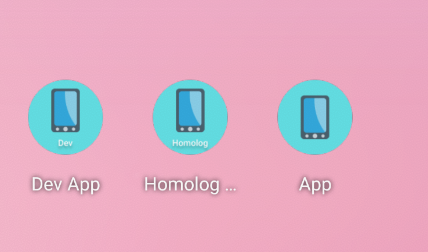
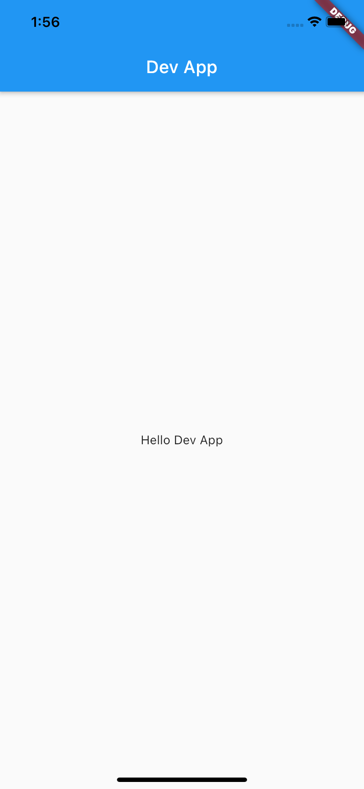
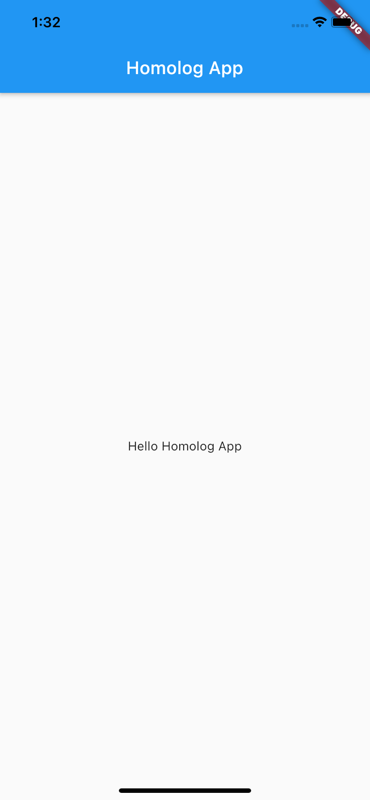
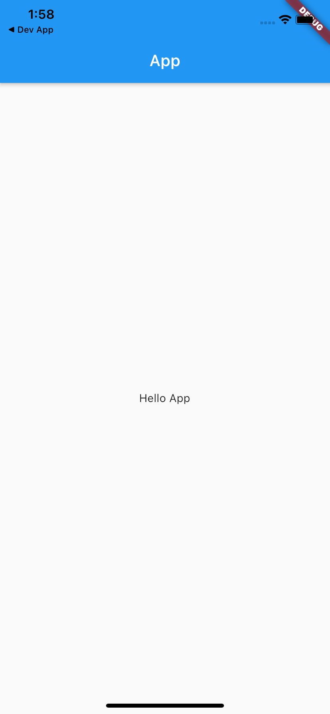

# Diferentes versões do mesmo app em flutter

Esse projeto tem todo o código usado no [post]() do instagram.

## Descrição

No post do instagram é mostrado como criar versões diferentes do mesmo app flutter. E nesse repositório é possível baixar e executar o código você mesmo, e verificar como funciona os **flavors** no flutter.

## Anexos

### Ícones diferentes para cada versão

### Telas de cada versão do app

|  Dev |  Homolog | Prod |
|---|---|---|
|   |   |   |

## Redes sociais

  

  

  

  